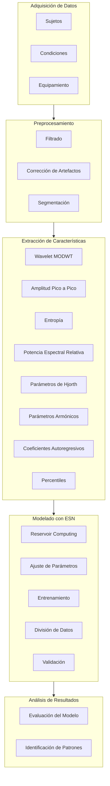

# Desarrollo Framework del modelo RC-ESN para el Procesado y Estudio de Señales EEG

## Objetivo
El objetivo principal es crear un framework que incluya diferentes librerías de Python, permitiendo el procesamiento y estudio de señales EEG mediante un modelo de Reservoir Computing.

El framework se utilizará tanto para datos sintéticos como para analizar señales EEG de diferentes sujetos en estado de reposo, utilizando un modelo de Reservoir Computing, específicamente Echo State Network (ESN). El propósito es identificar patrones en la dinámica temporal de las señales que permitan distinguir entre EEG de jóvenes adultos y personas mayores.

El framework contiene diversas librerías de Python con clases y funciones diseñadas para abarcar todo el ciclo del estudio, desde el tratamiento de datos hasta la evaluación de resultados.

# Estructura del Proyecto

    synthetic_eeg_v10.ipynb: Notebook donde se implementan datos sinteticos EEG y se utiliza el modelo MyRC para sus procesamiento.
                . Reconstrucciíon y predicción de señales temporales de los datos sintetigcos EEG
                . Clustering y clasifiación por métodos no supervisados de los datos sinteticos EEG
                . Clasificación por mñetodos supervisados de los datos sinteticos EEG
    data/: Carpeta con datos de prueba y entrenamiento.No se tienen por temas de privacidad.
    scripts/:Notebooks y scripts de python para el procesamiento y tratamiento de las señales EEG en crudo. 
            - Creación de datasets con la combinación de situaciones que se pueden dar:
                * Frecuencia de corto para paso bajo y poroporción de remuetreo o decimación.       
                * Con eliminación o sin eliminación de artefctos usando ICA.
                * Ectracción o no de features.
            - Utilizaxión de algoritmos de búsqueda óptima de hiperparámetro:
                * Algoritmo genético mediante librería deap.
                * Probabilidad bayesiana mediante librería 'optuna':
                        objective = create_objective (X, Y)
                        study     = optuna.create_study (direction = 'maximize')
                        study.optimize (objective, n_trials = 100)
                * Probabilidad bayesiana mediante librería 'scikit-optimize' y función 'gp_minimize'
                * Implementación ejemplo deep MyRC ESN sobre datos sintéticos.
    base/: librerias base donde seimplementa el modelo RC ESN y otra funciones auxiliares.
    README.md: Descripción del proyecto.EN CREACIÓN
    presentation/: Presentación del proyecto.EN CREACIÓN
    memoria/: Memoria del proyecto. EN CREACIÓN

# Instalación

Para instalar las dependencias del proyecto, ejecuta:
      
      pip install -r requirements.txt
      
Además hay que tener en cuena que se debe instarlar torch, dependerá del sistema operativo :
   https://pytorch.org/get-started/locally/
   
# Uso

Puedes utilizar tanto el código que hay en los notebooks como los diferentes scripts existentes. Modifica y crea tus propios notebook con ayuda de los diferentes módulos desarrollados que contienen tanto el API del RC ESN como clases y funciones auxiliares para el tratamiento de este tipo de datos.

## Procesos Desarrollados
 # Diagrama de Procesos



### 1. Adquisición de Datos
- **Sujetos**: Reclutamiento de dos grupos de sujetos, jóvenes adultos y adultos mayores.
- **Condiciones**: Grabación de señales EEG en estado de reposo.
- **Equipamiento**: Utilización de un sistema de adquisición de EEG con múltiples canales (ej. 32 o 64 canales).

### 2. Preprocesamiento de Señales EEG
- **Filtrado**: Aplicar un filtro de banda (ej. 0.2-30 Hz) para eliminar artefactos de baja y alta frecuencia.
- **Corrección de Artefactos**: Utilización de técnicas como Independent Component Analysis (ICA) para eliminar artefactos de movimiento ocular y musculares.
- **Segmentación**: Dividir las señales EEG en ventanas de tiempo (ej. epochs de mne de 3 segundos sin solapamiento). (sólo si se realiza extracción de caracterísricas)

### 3. Extracción de Características
Se extraerán características tanto en el dominio del tiempo como en el dominio de la frecuencia para cada ventana de tiempo.

- **Transformada Wavelet (MODWT)**:
  - Energía
  - Porcentaje de Energía
  - Media
  - Desviación Estándar

- **Amplitud Pico a Pico**:
  - Diferencia entre el valor máximo y mínimo de la señal en cada ventana.

- **Entropía**:
  - Entropía de Shannon, Renyi y Tsallis.

- **Potencia Espectral Relativa (RSP)**:
  - Potencia espectral relativa en diferentes sub-bandas de frecuencia (Delta, Theta, Alpha, Beta, Gamma).

- **Parámetros de Hjorth**:
  - Actividad
  - Movilidad
  - Complejidad

- **Parámetros Armónicos**:
  - Frecuencia Central
  - Ancho de Banda
  - Valor Espectral en la Frecuencia Central

- **Coeficientes Autoregresivos (AR)**:
  - Estimación de coeficientes AR y sus estadísticas (media y desviación estándar).

- **Percentiles**:
  - Percentiles 25, 50 y 75.

### 4. Modelado con Echo State Network (ESN)
- **Reservoir Computing**:
  - Utilización de un modelo ESN que consiste en una red recurrente con una gran cantidad de neuronas y conexiones aleatorias.
  - Ajuste de los parámetros del ESN (ej. tamaño del reservoir, densidad de conexiones, factor de escala de las conexiones).
  - Entrenamiento del modelo con las características extraídas de las señales EEG.

- **Entrenamiento y Validación**:
  - División de los datos en conjuntos de entrenamiento y prueba.
  - Entrenamiento del ESN con el conjunto de datos de entrenamiento.
  - Validación cruzada para evitar sobreajuste.

### 5. Análisis de Resultados
- **Evaluación del Modelo**:
  - Medición de la precisión del modelo en la clasificación de las señales EEG entre jóvenes adultos y adultos mayores.
  - Utilización de métricas como precisión, sensibilidad, especificidad y área bajo la curva ROC (AUC-ROC).

- **Identificación de Patrones**:
  - Análisis de los patrones en la dinámica temporal de las señales EEG identificados por el ESN. Se utiliza la matriz de similitud para vomprobar los distintos patrones de cada sujeto.
  - Visualización de las características más relevantes que permiten la distinción entre los dos grupos.

## Conclusión
El uso de un modelo de Reservoir Computing, como el ESN, puede ser efectivo para identificar patrones en la dinámica temporal de las señales EEG que distinguen entre jóvenes adultos y adultos mayores. Este enfoque combina técnicas avanzadas de procesamiento de señales y aprendizaje automático para proporcionar una herramienta poderosa en el análisis de EEG.

## Referencias (ver memoria asociada)
- Literatura sobre técnicas de procesamiento de señales EEG.
- Estudios previos que utilizan modelos de Reservoir Computing en análisis de señales temporales.
- Documentación y ejemplos de implementación de Echo State Networks (ESN).


# Evaluación con Datos Reales

Después de implementar y probar el modelo con datos sintéticos, se probó con un banco de datos reales de diferentes sujetos. Por motivos de privacidad, estos datos reales no se han subido, pero se incluyen los notebooks y scripts utilizados para el procesamiento de dichos datos.
Como no se añaden los datos raw orifinales, podriamos generar datos sintéticos con los canales que contienen los datos reales como son:
## Todos los Canales
```python
all_channels = ['Fp1', 'AF7', 'AF3', 'F1', 'F3', 'F5',
                'F7', 'FT7', 'FC5', 'FC3', 'FC1', 'C1',
                'C3', 'C5', 'T7', 'TP7', 'CP5', 'CP3',
                'CP1', 'P1', 'P3', 'P5', 'P7', 'P9',
                'PO7', 'PO3', 'O1', 'Iz', 'Oz', 'POz',
                'Pz', 'CPz', 'Fpz', 'Fp2', 'AF8', 'AF4',
                'AFz', 'Fz', 'F2', 'F4', 'F6', 'F8',
                'FT8', 'FC6', 'FC4', 'FC2', 'FCz', 'Cz',
                'C2', 'C4', 'C6', 'T8', 'TP8', 'CP6', 'CP4',
                'CP2', 'P2', 'P4', 'P6', 'P8', 'P10', 'PO8',
                'PO4', 'O2', 'UP', 'DOWN', 'LEFT', 'RIGHT',
                'EXG5', 'EXG6', 'EXG7', 'EXG8', 'Status']

eeg_channels = ['Fp1', 'AF7', 'AF3', 'F1', 'F3', 'F5', 'F7', 'FT7',
                'FC5', 'FC3', 'FC1', 'C1', 'C3', 'C5', 'T7', 'TP7',
                'CP5', 'CP3', 'CP1', 'P1', 'P3', 'P5', 'P7', 'P9',
                'PO7', 'PO3', 'O1', 'Iz', 'Oz', 'POz', 'Pz', 'CPz',
                'Fpz', 'Fp2', 'AF8', 'AF4', 'AFz', 'Fz', 'F2', 'F4',
                'F6', 'F8', 'FT8', 'FC6', 'FC4', 'FC2', 'FCz', 'Cz',
                'C2', 'C4', 'C6', 'T8', 'TP8', 'CP6', 'CP4', 'CP2',
                'P2', 'P4', 'P6', 'P8', 'P10', 'PO8', 'PO4', 'O2']

eog_channels = ["UP", "DOWN", "LEFT","RIGHT"]
exg_channels = ['EXG5', 'EXG6', 'EXG7', 'EXG8']
```
# La ***primera fase*** del proyecto fue el ***estudio de este tipo de señales EEG***.

Se crea un script para procesar lso datos raw y crear ficheros con dataset con las señales EEG procesadas.

# La **segunda fase** fue el  ***Procesamiento de Señales EEG***: 

Las señales EEG procesadas permiten la reconstrucción y predicción de patrones temporales. Además, se utiliza tanto el aprendizaje supervisado como no supervisado para extraer características significativas y realizar la clasificación de sujetos. Este preprocesamiento incluye varias etapas esenciales para asegurar la calidad y usabilidad de los datos:

##### Filtrado de Datos

##### Eliminación de Artefactos


# la **tercera fase del proyecto** creación API para el uso mode

Se construyó una API configurada mediante un diccionario config. Este diccionario contiene diferentes parámetros que se transforman en hiperparámetros para el modelo, permitiendo una fácil personalización y ajuste del modelo a diferentes necesidades experimentales.

# Entregas presentes en el proyecto 

### Datos Sintéticos

Los datos sintéticos son generados artificialmente para simular situaciones específicas o para llenar lagunas en conjuntos de datos reales. En esta sección, se explica cómo se generaron datos sintéticos para simular señales temporales de los diferentes electrodos en cada EEG de cada sujeto. Se describen los métodos y algoritmos utilizados para generar estos datos sintéticos y cómo se ajustan a las características de los datos reales, incluyendo la adición de ruido para simular condiciones más realistas.

### RC ESN

Se entrega un notebook con el cual se realizó el procesado y tratamiento de los datos reales, creando diferentes datasets con diferentes combinaciones de canales y funcionalidades (frecuencias del filro pasa banda, eliminación o no de artefactos, extracción o no de características).

En el mismo notebook se implementa varios chunks ejemplo del uso del API del RC ESN para la omplementaión de m´ñtodos no supercisaos y obtención de clústers de sujetos (jovenes adultos y mayores). Así como el uso de readout para la clasificación supervisada de lso sujetos. 

Además se presentan diferentes scripts de python donde se peuden ejecutar el mismo código comentado. 
Se aportan difernetes scripts con algoritmo geneticos y probabilidad bayesiana para la búsqueda, a modo gridsearch, de los valores óptimos para aquellos hiperparñametros más omportantes.

### Deep ESN

Se entrega un notebook que contiene una posible implementación de un modelo DeepESN con el modelo ESN implementado en el proyecto. Solo se implementa el modelo DeepESN pero no se ha utilizado en el proyecto ni se ha estudiado una posible optimización de la arquitectura. Se deja como trabajo futuro.

# Resultados


Los resultados de las evaluaciones se guardan en la carpeta results/.

# Contacto

Para cualquier consulta, contacta a jogugil@gmail.com/jogugil@alumni.uv.es

